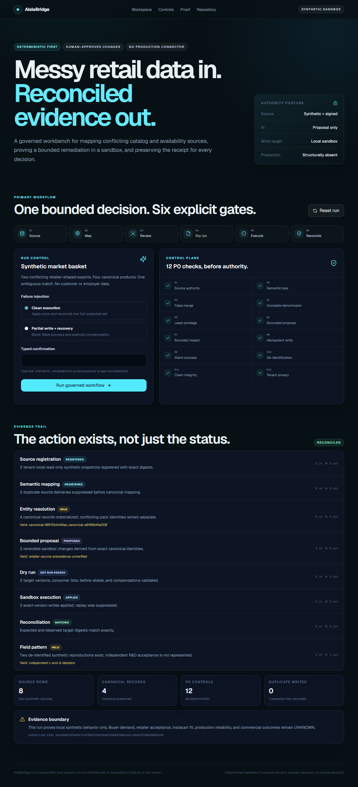

# AisleBridge

**A governed retail-integration workbench that turns conflicting catalog and availability sources into a human-reviewable mapping, a bounded sandbox change, and a receipt-backed reconciliation or recovery.**

[](https://nextjs.org/) [](https://www.typescriptlang.org/) [](#evidence-boundary) [](LICENSE)

> Independent work sample. AisleBridge is not affiliated with or endorsed by Instacart or any retailer. Public role context informed the problem framing; it is not customer demand, internal architecture evidence, or employer approval.



## The problem

Retail catalog, price, promotion, and availability truth often crosses PIM, ERP, POS, e-commerce, fulfillment, vendor, and spreadsheet systems. A connector can parse every row and still be wrong: a weighted item becomes “each,” store scope disappears, an unknown stock signal becomes zero, or a partial write returns success.

AisleBridge treats that as an authority-and-evidence problem, not merely an ETL problem.

## Who it is for

- Forward-deployed and integration engineers who own a retailer implementation end to end.
- Retail catalog, e-commerce, and data operators who approve meaning and scope.
- Security and change authorities who control capabilities and rollback.
- Platform teams that need customer-local learnings converted into de-identified, reproducible contracts.

## What is implemented

The repository contains a runnable, production-shaped vertical slice using clearly marked synthetic data:

1. Register two tenant-local, read-only source receipts with immutable digests.
2. Map eight conflicting source rows into four canonical products while preserving pack, unit, location, and freshness semantics.
3. Accept exact identifier matches and hold an ambiguous pair for human review.
4. Produce one evidence-grounded, reversible proposal with no execution authority.
5. Derive and dry-run two affected records, downstream consumers, before-state, and distinct compensating changes.
6. Require a freshly typed confirmation bound to the exact plan digest, execute once in an in-memory sandbox, and suppress a duplicate operation key.
7. Read the sandbox back and compare exact expected/observed digests; or inject a partial write and execute compensation back to the baseline.
8. Derive stage counts and SHA-256 evidence receipts from the resulting state, while keeping commercial/provider unknowns explicit.

The same build includes 12 one-to-one P0 detectors, 24 bad/good fixtures, an all-detector executable mutation harness, a typed API boundary, a Supabase schema with RLS and tenant-qualified relationships, responsive UI, and desktop/mobile E2E coverage.

## Architecture

```mermaid
flowchart LR
  A["Signed or synthetic sources"] --> B["Tenant and source registry"]
  B --> C["Canonical retail contract"]
  C --> D["Deterministic identity and invariants"]
  D --> E["Bounded proposal"]
  E --> F["Human review gate"]
  F --> G["Dry-run and compensation proof"]
  G --> H["Local sandbox execution"]
  H --> I["Complete reconciliation"]
  I -->|mismatch| J["Pre-approved compensation"]
  I --> K["Evidence receipts"]
  J --> K
```



The dependency direction is deliberate: source truth → pure validators → proposal → human authority → sandbox action → readback and reconciliation. The model-shaped proposal surface has no independent authority to approve, write, or promote a platform pattern.

See [Architecture and contracts](docs/architecture.md) and the [Supabase migration](supabase/migrations/0001_aislebridge_core.sql).

## Deterministic / AI / human split

| Layer | Responsibility | Current state |
|---|---|---|
| Deterministic | tenant/source checks, semantic completeness, exact identity, denominators, impact, idempotency, reconciliation, receipts | **Implemented** |
| AI-shaped proposal boundary | cited transform proposal, assumptions, confidence, abstention | **Implemented as deterministic synthetic proposal; no model call** |
| Human | type a fresh confirmation for the exact plan digest; approve semantics, recovery, and R&D promotion | **Structurally required; synthetic approval only in demo** |
| Provider/customer | live auth, persistence, connectors, deployment, security acceptance | **Not connected / UNKNOWN** |

The primary workflow still runs with AI disabled. There are no runtime AI calls and no secret is required.

## Run locally

Requirements: Node.js 20.9+ and npm.

```bash
git clone https://github.com/shrishmanglik/aisle-bridge.git
cd aisle-bridge
npm ci
npm run dev
```

Open `http://localhost:3000`, choose the clean or recovery scenario, then type the complete `RUN SYNTHETIC <PLAN_DIGEST_PREFIX>` phrase shown for that exact plan and run the workflow.

## Verification

```bash
npm run typecheck
npm run lint
npm test
npm run test:accessibility
npm run test:security
npm run test:recovery
npm run test:mutation
npm run build
npm run test:e2e
```

To prove the adjacent-check guard is real, deliberately disable the critical duplicate/partial-write detector. The command must fail:

```powershell
$env:AISLEBRIDGE_DISABLED_DETECTOR='DET-AB-R8'
npm.cmd run test:control
Remove-Item Env:AISLEBRIDGE_DISABLED_DETECTOR
```

With the detector restored, `npm run test:control` passes. See the [evidence manifest](docs/evidence-manifest.md) for the exact current results and claim ceilings.

## Security and privacy

- No customer, employer, loyalty, payment, credential, or personal data is included.
- Production capability is structurally absent from the runnable slice.
- The API requires freshly typed confirmation bound to the exact plan digest and labels responses `synthetic-only`.
- Supabase DDL enables and forces RLS on every table and uses tenant-qualified parent-child foreign keys; it has not been applied to a provider.
- Audit events are append-only by privilege: authenticated updates and deletes are revoked.
- `.env*`, logs, build output, traces, and test artifacts are excluded from Git.
- An indeterminate write never becomes success; it must reconcile or recover.

Read the full [security, privacy, and threat boundary](docs/security.md).

## Commercial hypothesis

The governed blueprint proposes a paid, bounded catalog-integrity diagnostic and launch. Buyer demand, pricing, delivery hours, contribution margin, repeat use, and retailer acceptance have not been validated. No public price or viability claim is made by this implementation.

Commercial validation belongs outside the code gate: qualified buyer interviews, safe artifact audits, explicit price conversations, paid diagnostics, observed cost, security acceptance, and repeat purchase evidence.

## Evidence boundary

**Proven locally:** source-to-sandbox workflow behavior against synthetic fixtures; deterministic controls; mutation sensitivity; exact digests; typecheck/lint/test/build; desktop and mobile browser journeys.

**Not proven:** Instacart need or architecture fit, retailer demand, customer outcomes, production readiness, provider configuration, live Supabase RLS, deployment, security acceptance, revenue, pricing, or reliability targets. Those states remain `UNKNOWN` until their owning authority produces evidence.

## Error, retry, and rollback

- Malformed or under-authorized input is terminal until corrected.
- Transient failure may retry only when no durable receipt exists.
- Duplicate operation keys return the same logical result and never apply twice.
- Partial or indeterminate writes freeze closure and require target readback.
- Recovery uses a distinct compensating change and terminal reconciliation receipt.

The [operator runbook](docs/operator-runbook.md) contains the state machine and recovery drill.

## Implemented versus proposed

| Capability | State |
|---|---|
| Synthetic source intake, mapping, proposal, dry-run, execute, reconcile, recover | Implemented |
| 12 detectors + 24 fixtures + all-detector mutation harness | Implemented |
| Typed `/api/workflow` service boundary | Implemented |
| Supabase tenant schema and RLS policy source | Implemented, not applied |
| Real retailer connector and identity provider | Proposed |
| Live persistence, authentication, telemetry, and provider operations | Proposed / UNKNOWN |
| AI model integration | Intentionally absent; proposal boundary only |
| Buyer demand, paid pilot, commercial outcomes | Unvalidated / UNKNOWN |

## Roadmap

1. Obtain independent code and evidence review for this branch.
2. Validate the problem with qualified retailer operators without using customer data in the public repository.
3. Add an authorized local Supabase integration test against ephemeral infrastructure; retain RLS mutation proof.
4. Add a signed-export connector behind the current read-only capability contract.
5. Consider any model provider only after deterministic baselines, approved data classes, and an evaluation gate exist.

## Repository map

- `app/` — Next.js App Router UI and typed workflow endpoint.
- `src/detectors/` — 12 fail-closed deterministic controls.
- `src/services/` — pure source-to-reconciliation workflow engine.
- `src/fixtures/` — synthetic bad/good acceptance fixtures.
- `supabase/migrations/` — tenant schema and RLS source contract.
- `tests/` — acceptance, mutation, security, recovery, accessibility, and browser journeys.
- `docs/` — architecture, operations, security, screenshot, and evidence manifest.

## License

MIT. See [LICENSE](LICENSE).
